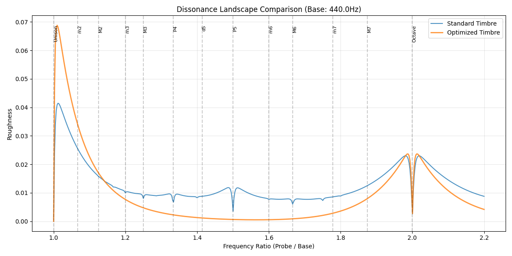

# Dissonance Descent

**Physics-Based Timbre and Scale Optimization System**

A computational engine that simulates the relationship between musical timbre (spectral content) and harmony (consonance/dissonance). Based on the psychoacoustic research of Plomp, Levelt, and William Sethares, this system uses numerical optimization to automatically generate "perfect" timbres for arbitrary musical pieces.



## Overview

Traditional music theory assumes "in-tune" notes are fixed universal ratios (e.g., Perfect Fifth = 3:2). However, psychoacoustic physics demonstrates that **consonance is not an inherent property of intervals**, but a result of the interference between the overtones (harmonics) of specific sounds.

This project implements:
- **Plomp-Levelt Curve**: A model describing the "roughness" (dissonance) between two pure sine waves based on their frequency difference
- **Sethares' Extension**: Total dissonance of complex tones as the sum of roughness of all partial pairings
- **Timbre Optimization**: Gradient descent to find optimal partial frequencies and amplitudes that minimize perceptual roughness

## Features

- 🎵 **MIDI Parsing**: Event-based slicing for continuous harmonic analysis
- 🎛️ **Dense Frequency Grid**: Explore timbre space beyond fixed harmonic ratios
- 📈 **ADSR Optimization**: Optimize attack, decay, sustain, and release per partial
- 🚀 **GPU Acceleration**: CUDA/MPS support via PyTorch for faster computation
- 🔄 **Multi-Restart Optimization**: Multiple random initializations to escape local minima
- 🎨 **Visualizations**: Convergence plots, frequency migration, and dissonance landscapes
- 🔊 **Audio Synthesis**: Additive synthesis with per-partial envelopes

## Installation

```bash
# Clone the repository
git clone https://github.com/Axfff/dissonance-descent.git
cd dissonance-descent

# Create virtual environment (recommended)
python -m venv .venv
source .venv/bin/activate  # On Windows: .venv\Scripts\activate

# Install dependencies
pip install -r requirements.txt
```

### Dependencies

- `numpy` - Numerical computing
- `scipy` - Optimization algorithms
- `mido` - MIDI file parsing
- `soundfile` - Audio I/O
- `matplotlib` - Visualization
- `numba` - JIT compilation for performance
- `torch` - GPU acceleration (optional)
- `flask` - Web interface (optional)

## Quick Start

### Basic Usage

```bash
# Run the main experiment with Bach Prelude in C
python run_experiment.py
```

This will:
1. Parse the MIDI file (`bach_prelude.mid`)
2. Generate time slices based on note overlaps
3. Optimize the instrument timbre to minimize global dissonance
4. Render audio comparisons (`output_standard.wav` vs `output_optimized.wav`)
5. Generate visualizations

### Simple Chord Optimization

```bash
python main.py
```

Optimizes a detuned major chord to find mathematically "pure" intervals.

## Configuration

All parameters are controlled via `config.json`:

```json
{
  "plomp_levelt": {
    "a": 0.5,      // Fall-off rate of dissonance
    "b": 14,       // Rise rate of dissonance
    "s1": 0.021,   // Critical bandwidth slope
    "s2": 19.0     // Critical bandwidth offset
  },
  "timbre": {
    "partials": [
      {"ratio": 1.0, "amplitude": 1.0, "envelope": {...}},
      {"ratio": 2.0, "amplitude": 0.7, "envelope": {...}}
    ]
  },
  "optimization": {
    "mode": "enhanced",
    "frequency_grid": {"enabled": true, "min_ratio": 1.0, "max_ratio": 3.0, "step": 0.5},
    "optimize_adsr": {"enabled": false},
    "multi_restart": {"enabled": true, "n_restarts": 2},
    "gpu": {"enabled": true, "device": "auto"}
  }
}
```

## Project Structure

```
harmonyDesent/
├── src/
│   ├── dissonance.py        # Plomp-Levelt dissonance calculation
│   ├── dissonance_fast.py   # Numba-accelerated version
│   ├── dissonance_gpu.py    # GPU-accelerated version (PyTorch)
│   ├── midi_parser.py       # MIDI → time slices conversion
│   ├── optimizer.py         # Basic optimization
│   ├── optimizer_enhanced.py # Enhanced optimization with grid search
│   ├── multi_restart.py     # Multi-restart optimization strategy
│   ├── synthesizer.py       # Additive synthesis engine
│   ├── visualizer.py        # Basic visualizations
│   └── visualizer_enhanced.py # Enhanced visualizations
├── config.json              # Configuration file
├── main.py                  # Simple chord optimization demo
├── run_experiment.py        # Full MIDI experiment
├── bach_prelude.mid         # Example MIDI file
└── experiments/             # Output directory for results
```

## Key Concepts

### The Cost Function

The global dissonance is defined as the time-integral of roughness over the entire piece:

$$D_{global} = \sum_{i=0}^{N} ( D(S_i, \text{Timbre}) \times \text{Duration}_i )$$

Where:
- $S_i$: Set of active notes in slice $i$
- $D(...)$: Plomp-Levelt roughness score
- $\text{Duration}_i$: Duration of that harmonic state

### Plomp-Levelt Model

The dissonance between two pure tones is:

$$d(f_1, f_2) = e^{-a \cdot s} - e^{-b \cdot s}$$

Where $s$ is the normalized frequency difference based on critical bandwidth.

## Example Results

After optimization, you can expect:
- **15-30% reduction** in global dissonance
- Redistribution of energy across partials
- Smoother timbral transitions through dissonant passages

## Advanced Usage

### GPU Acceleration

Enable in `config.json`:
```json
"gpu": {
  "enabled": true,
  "device": "auto"  // "cuda", "mps", or "cpu"
}
```

### Multi-Restart Optimization

```json
"multi_restart": {
  "enabled": true,
  "n_restarts": 5,
  "strategies": ["perturb", "smart", "random"]
}
```

### Web Interface

```bash
python app.py
```

Opens a Flask-based GUI for interactive timbre design.

## Contributing

Contributions are welcome! Please feel free to submit issues and pull requests.

## References

- Plomp, R., & Levelt, W. J. M. (1965). *Tonal consonance and critical bandwidth*
- Sethares, W. A. (1993). *Local consonance and the relationship between timbre and scale*
- Sethares, W. A. (2005). *Tuning, Timbre, Spectrum, Scale*

## License

MIT License - See [LICENSE](LICENSE) for details.

---

*"If you change the instrument (timbre), the points of minimum dissonance shift, creating new natural scales."*
